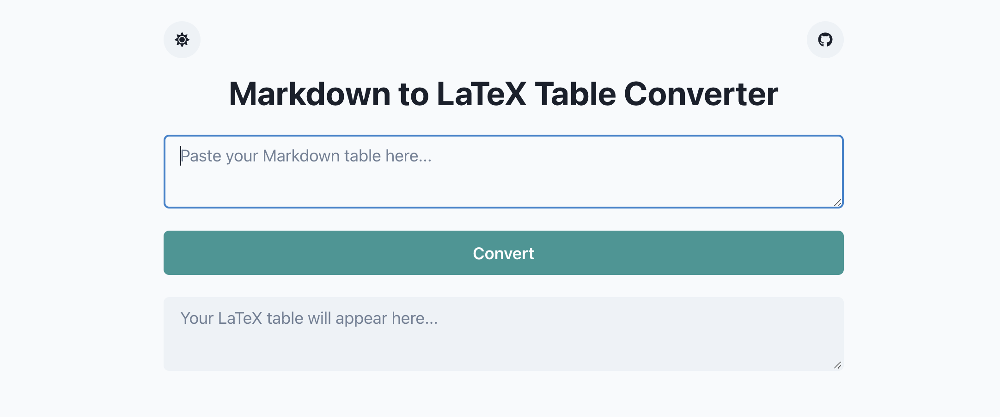

# Markdown to LaTeX Table Converter

Convert your Markdown tables to LaTeX format easily with our online tool.

site: https://argonism.github.io/MdTable2Latex/

 <!-- If you have a screenshot of the tool, add it here for better visualization -->

## Features

- Simple and intuitive interface
- Instant conversion
- Mobile-friendly design
- 100% client-side: Secure, no data sent to any server

## Usage

1. Visit [Markdown to LaTeX Table Converter](https://argonism.github.io/MdTable2Latex/)
2. Paste your Markdown table into the input area.
3. Click "Convert".
4. Your LaTeX table will appear in the output area below.

## Contributing

Pull requests are welcome. For major changes, please open an issue first to discuss what you would like to change.

## License

[MIT](https://choosealicense.com/licenses/mit/)
